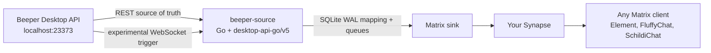
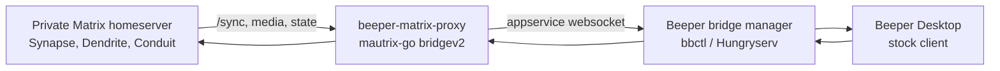

# beeper-matrix-proxy

**Expose rooms from a private Matrix homeserver inside Beeper Desktop, using a
stock Beeper client and a bridgev2 custom bridge.**

[](https://go.dev/)
[](https://matrix.org/)
[](https://developers.beeper.com/bridges/self-hosting)
[](#current-status)

`beeper-matrix-proxy` is an experimental Matrix/Beeper proxy built on
[`mautrix-go` bridgev2](https://pkg.go.dev/maunium.net/go/mautrix/bridgev2).
Its original mode treats a normal Matrix homeserver as the remote network and
exposes joined rooms inside Beeper through Beeper's self-hosted bridge flow
(`bbctl`). A new `beeper-source` subsystem starts the reverse direction:
Beeper Desktop API as the source network, with your own Synapse/Matrix server as
the destination appservice side.

It does **not** patch Beeper Desktop. The bridge tries to speak the data contract
that Beeper already understands: room features, Matrix events, media metadata,
portal rooms, and appservice websocket traffic.

## Beeper Source Mode

`beeper-source` is the foundation for exposing Beeper's existing cloud/local
accounts as standard Matrix rooms:



The first implemented slice is intentionally infrastructure-heavy: SDK pinning,
local-only config, deterministic Matrix transaction IDs, SQLite WAL schema,
message/portal/puppet mapping, pending mutation storage, all-chat WebSocket
subscription payloads, echo suppression, media size fallback policy, and
Deeper-style platform detection. This gives the eventual Matrix appservice
adapter a stable low-latency core without coupling it to Beeper Desktop UI
patches.

Current `beeper-source` implementation status:

| Area | Status | Notes |
|---|---:|---|
| Beeper Desktop Go SDK | Supported | Pinned to `github.com/beeper/desktop-api-go/v5@v5.0.1`. |
| `/v1/info` healthcheck | Supported | Uses the official SDK and keeps Beeper local-only by default. |
| Chat/message REST abstraction | Partial | Adapter maps SDK chats/messages into bridge-neutral structs. |
| WebSocket subscription | Supported | Generates Beeper's `subscriptions.set` all-chat command; reconnect loop is still next work. |
| SQLite WAL state | Supported | Creates `portal`, `puppet`, `message_mapping`, `reaction_mapping`, `pending_mutation`, `media_cache`, and `queue`. |
| Deterministic txn IDs | Supported | Stable hash from chat/message/mutation/version. |
| Beeper -> Matrix text mirror core | Supported | `cmd/beeper-source` can create Matrix rooms and mirror Beeper text messages into them. |
| Matrix -> Beeper text/media core | Supported | Matrix `/sync` reader forwards user text and Matrix media from portal rooms to Beeper with stored sync tokens. |
| Matrix -> Beeper edits/deletes/reactions | Supported | Live-tested in the Signal test group through Beeper Desktop API update/delete/reaction endpoints. |
| Cinny visibility | Supported | Verified in Cinny v4.11.1: WhatsApp, Signal, and sh-vcvm test rooms appear as Matrix rooms. |
| Beeper chat avatars -> Matrix room icons | Supported | Beeper `imgURL`/asset avatars are uploaded to Matrix and refreshed on existing portal rooms. |
| All active Beeper chats in Matrix/Cinny | Supported | `cmd/beeper-source -rooms-only` creates/updates portal rooms for every non-archived Beeper chat without importing history or sending to contacts. Latest VCVM run imported all 694 active chats with 0 missing. Archived chats can be opted in. |
| Platform names/icons | Supported | Rooms-only mode groups rooms into Matrix Spaces per Beeper `network` (`WhatsApp`, `Signal`, `Telegram`, etc.); generated platform PNG logos are cached once per service for the service spaces and as a room-avatar fallback when a chat has no Beeper `imgURL`. |
| Matrix Spaces by messenger | Supported | Rooms-only import creates a Beeper root space and top-level service spaces for WhatsApp, Signal, Telegram, bridgev2, and Beeper(Matrix), then links portal rooms under the matching service. |
| Echo suppression | Supported | Persistent SQLite echo table maps Beeper echoes back to the original Matrix event, including changed echo versions after edits. |
| Media policy | Partial | Matrix -> Beeper multipart upload works; oversized-media fallback exists. Full streaming for very large files is still future work. |
| Deeper enrichment | Partial | Platform detection implemented; contact merging and analytics reports are later. |

Latest local E2E evidence from 2026-05-21:

| Path | Test group | Result |
|---|---|---|
| All-chat rooms-only import | VCVM Synapse + Cinny | Beeper discovery found 700 chats: 694 active and 6 archived. SQLite holds 701 portal rows, all 694 active Beeper chat IDs are present, and `@cinny_beeper_test:100.120.120.120` is joined to 701/701 portal rooms. Screenshot: `/tmp/beeper-source-cinny-all-chats-final.png`. |
| Rooms-only backpressure/retry | VCVM Synapse | Final idempotency pass completed after accessibility checks in `150.89s`; previous bulk run created 620 new rooms in `439.70s`, resumed in `5.36s`, and recreated stale active portals in `11.20s`. |
| Matrix Spaces by service | VCVM Synapse + Cinny | Root space has 5 service-space children; service spaces contain WhatsApp 511, Telegram 90, Signal 47, bridgev2 45, and Beeper(Matrix) 1 rooms. `@cinny_beeper_test:100.120.120.120` joined all 6 spaces. Screenshot: `/tmp/beeper-source-cinny-whatsapp-space-png.png`. |
| Messenger logo avatars | VCVM Synapse + Cinny | Platform avatar cache now uses `platform-logo-v3:*` PNG media. WhatsApp/Signal/Telegram/bridgev2/Beeper(Matrix) service spaces all expose `m.room.avatar` with `image/png`; the WhatsApp PNG was downloaded and verified with a PNG signature. |
| Matrix/Cinny -> Beeper text | Signal | Message `165648` created from Matrix event `$6B7BFH1w4X_kgCuD9_4T5Ad9TAvAoLmuHWQkSsbBKZA`. |
| Matrix/Cinny -> Beeper edit | Signal | Same message updated to `edited-ok` and exposed `editedTimestamp`. |
| Matrix/Cinny -> Beeper reaction | Signal | Matrix reaction became Beeper reaction `🎉`. |
| Matrix/Cinny -> Beeper delete | Signal | Same message became `isDeleted: true` through Beeper API. |
| Matrix/Cinny -> Beeper image | Signal | PNG uploaded as Beeper `IMAGE` with `image/png` metadata. |
| Matrix/Cinny -> Beeper text + image | WhatsApp | Text `165911` and image `165912` arrived with filename, MIME type, and dimensions. |
| Cinny room list | VCVM Synapse | Browser-verified rooms: `Beeper BotE2E:[signal] Test`, `Beeper BotE2E:[whatsapp] Test`, `Beeper BotE2E:[sh-vcvm-matrix] Test`, plus the non-bot test rooms. |
| Beeper chat avatar -> Matrix room icon | WhatsApp | Live WhatsApp test room received `m.room.avatar` with an `mxc://` JPEG and Cinny showed `changed room avatar`. |
| Matrix reply -> Beeper reply | Signal | Matrix `m.in_reply_to` was remapped to Beeper `linkedMessageID` (`166168 -> 166067`). |
| Beeper reply -> Matrix reply | Signal | Beeper `replyToMessageID` was remapped to Matrix `m.in_reply_to` (`166220 -> $hbWt...`). |
| Matrix/Cinny -> Beeper file, GIF, audio | Signal + WhatsApp | File, `image/gif` with `isGif:true`, and `audio/wav` arrived in both test groups. |
| Beeper -> Matrix file, GIF, audio | Signal + WhatsApp | File, GIF, and audio arrived as `m.file`, `m.image` with `fi.mau.gif:true`, and `m.audio`. |
| One-run echo mapping | Signal | Matrix -> Beeper message `166233` mapped back to the original Matrix event in one proxy run. |

### Show Beeper Bridges In Cinny

Goal: use Cinny as a normal Matrix client and see chats from Beeper's connected
accounts (WhatsApp, Telegram, Signal, X, and other Beeper-backed networks) as
Matrix rooms on your own Synapse.

For a safe first import that only creates/updates rooms and does not send
anything back to real Beeper contacts:

```bash
export BEEPER_MATRIX_PROXY_SYNC_MODE=read_only
export BEEPER_MATRIX_PROXY_DISABLE_MATRIX_TO_BEEPER=true
# rooms-only enables Matrix Spaces automatically and keeps Beeper chat avatars preferred
export BEEPER_MATRIX_PROXY_PORTAL_WORKERS=8
export BEEPER_MATRIX_PROXY_PORTAL_TIMEOUT_SECONDS=180
# Optional: remove the "Beeper: " room-name prefix too
# export BEEPER_MATRIX_PROXY_MATRIX_ROOM_PREFIX=""
# Optional: export BEEPER_MATRIX_PROXY_INCLUDE_ARCHIVED=true
unset BEEPER_MATRIX_PROXY_BEEPER_CHAT_IDS

go run ./cmd/beeper-source -db beeper-source-all-chats.db -once -rooms-only
```

This uses Beeper's paginated `/v1/chats` API, so it is not limited to the first
page. Rooms-only mode also forces `sync.mode=read_only` and
`safety.disable_matrix_to_beeper=true`, even if the environment was configured
for bidirectional sync. By default, archived chats are skipped so Cinny mirrors
the normal active Beeper chat list.

Bulk room creation is resumable. Existing accessible portal rows are skipped,
stale rows whose Matrix rooms are no longer accessible are recreated, platform
avatars use the `media_cache` key family `platform-logo-v3:*`, and Matrix `429
M_LIMIT_EXCEEDED` responses honor `retry_after_ms`/`Retry-After` with adaptive
worker backpressure instead of aborting the whole import. The import also
creates Matrix Spaces: a Beeper root space links service spaces, and each
service space links its portal rooms so Cinny can navigate by messenger instead
of one long flat room list.

Rooms-only mode omits the bracketed platform from room names because the Matrix
Spaces already provide the service grouping. Set
`BEEPER_MATRIX_PROXY_MATRIX_ROOM_INCLUDE_PLATFORM=true` to restore names like
`Beeper: [Telegram] Chat Name`. Set
`BEEPER_MATRIX_PROXY_MATRIX_PLATFORM_AVATARS=true` only when you explicitly want
every portal room to use the messenger logo instead of the Beeper/BIPA chat
profile picture. With the default setting, Beeper `imgURL` avatars are fully
downloaded through the Desktop API, including relative BIPA asset URLs resolved
against `BEEPER_MATRIX_PROXY_BEEPER_BASE_URL`; platform logos are used only as a
fallback when no chat avatar exists.

For a fast refresh of already-created rooms, for example after changing room
name/avatar settings, you can set `BEEPER_MATRIX_PROXY_PORTAL_CHECK_ACCESS=false`
and `BEEPER_MATRIX_PROXY_MATRIX_SPACES=false`. That skips stale-room probing and
space relinking while still running in `read_only` mode and refreshing existing
portal room names, topics, and avatars.

```bash
export BEEPER_ACCESS_TOKEN="..."
export MATRIX_ACCESS_TOKEN="..."
export BEEPER_MATRIX_PROXY_MATRIX_HOMESERVER_URL="https://vcvm.tail6a40cd.ts.net:3443"
export BEEPER_MATRIX_PROXY_MATRIX_USER_ID="@openclaw:100.120.120.120"
export BEEPER_MATRIX_PROXY_MATRIX_INVITE_USER_ID="@openclaw:100.120.120.120"
export BEEPER_MATRIX_PROXY_MATRIX_INSECURE_TLS=true # only for the local VCVM self-signed cert

go run ./cmd/beeper-source -db beeper-source.db -once
```

After the first reconcile pass, open Cinny at:

```text
https://vcvm.tail6a40cd.ts.net:3091/login/vcvm.tail6a40cd.ts.net:3443
```

The current implementation is a pragmatic v1 mirror: messages are sent by the
configured Matrix account with a Beeper per-message profile and sender prefix so
Cinny can show who wrote them. For bidirectional testing, run the proxy with a
dedicated Matrix bridge account and set `BEEPER_MATRIX_PROXY_MATRIX_INVITE_USER_ID`
to the Matrix user that will use Cinny. The Matrix `/sync` reader ignores events
from the bridge account, forwards user-authored portal-room messages to Beeper,
and suppresses the Beeper echo on the next reconcile pass. The next production
step is a true Synapse appservice registration for one Matrix ghost user per
Beeper sender.

## Performance Snapshot

Latest local run on Apple M4 Pro, using `./scripts/perf.sh` plus disposable
Docker Synapse E2E:

| Area | Before | Now | Improvement |
|---|---:|---:|---:|
| Message content clone latency | ~2408 ns/op | ~120 ns/op | ~20x faster |
| Message content clone allocations | 20 allocs/op | 5 allocs/op | 75% fewer |
| Message content clone bytes | 1425 B/op | 576 B/op | ~60% fewer |
| Repeated fallback avatar path | 38 allocs/run | 0 allocs/op | allocation-free cache hit |
| Poll/raw event clone allocations | ~60 allocs/run | 12 allocs/op | ~80% fewer |
| Default remote `/sync` burst window | 50 timeline events | 100 timeline events | 2x larger |
| Local Synapse burst E2E | 40/40 messages | 100/100 messages | larger verified burst |
| `beeper-source` 500-text-message reconcile benchmark | ~25.0 ms/op, 1.44 MB/op | ~26.2 ms/op, 1.44 MB/op | steady after reply/avatar additions |
| Matrix -> Beeper echo mapping | required a second manual run | one proxy run when Matrix events were handled | faster stable mappings with no extra idle reconcile |

The current 100-message Synapse burst test delivered all events with roughly
`1.88s` send time and `15ms` sync pickup time in the local harness. A mixed
modality E2E run also verifies text, image, file, audio, video, location, emote,
notice, edit, sticker, reaction, redaction, poll start, room state, and call
invite events against the same disposable Synapse.
These
numbers are not a production SLA, but they make the hot paths reproducible and
guard against regressions.

## The Short Version

| Question | Answer |
|---|---|
| Can I sign into an arbitrary Matrix homeserver directly from Beeper Desktop? | Not generally. Beeper Desktop is designed around Beeper accounts and Beeper-managed bridge accounts. |
| Can this project show rooms from my private Matrix server in Beeper? | Yes, that is the goal: private Matrix homeserver -> this bridge -> Beeper. |
| Can this reuse Beeper Cloud's existing WhatsApp/Telegram/Signal bridges on my own Synapse? | Experimentally, yes through `beeper-source`: Beeper Desktop API is treated as the source and your Synapse receives portal rooms. |
| Can I run official/community bridges for my own Synapse instead? | Yes. Run the upstream Matrix bridge against your Synapse as its own appservice. |
| Can one bridge feed both Beeper and my Synapse? | Usually not safely from the same database. Run separate bridge instances or build a dedicated fanout layer. |

## Architecture



Beeper's official self-hosting docs describe `bbctl` as a tool for running
self-hosted bridges with a Beeper account. Beeper's bridge metadata also
distinguishes cloud, self-hosted, local, and platform-sdk providers. This matters
because a Beeper Cloud bridge is not a portable appservice registration that can
simply be pointed at your own Synapse.

## Current Status

This is a working research/prototype bridge, not a polished product. It already
contains the core compatibility fixes that made private Matrix rooms usable in
Beeper during testing:

- burst-safe Matrix `/sync`
- room discovery and portal creation
- message, edit, reply, and relation ID rewriting
- Beeper-compatible poll fallback normalization
- media reupload between homeservers
- opt-in bridgev2 direct media support with signed, expiring media IDs
- live typing notifications and read receipts
- Matrix call invites bridged as safe notices
- conservative media size capabilities to avoid proxy-side HTTP 413 failures
- restart-safe remote reaction redactions
- lean Matrix sync filter with lazy-loaded members
- bounded echo-suppression cache for Beeper -> Matrix sent events
- cached generated fallback avatars for stale or unavailable remote media
- reproducible benchmarks and local Synapse burst E2E artifacts
- multi-Synapse E2E runs, including optional parallel execution across
  disposable homeservers
- mixed-modality local Synapse E2E coverage for text, image, file, audio, video,
  location, emote, notice, edits, stickers, reactions, redactions, polls, room
  state, and call notices
- real Synapse checks for upload-limit enforcement, room profile state
  (`m.room.name`, `m.room.topic`, `m.room.avatar`), and reply/thread relations
- real Synapse edge probes for media config, history pagination, and
  restart/reconnect continuity with the previous sync token
- one explicit 30-point Synapse E2E matrix that exercises the full dev checklist
  on every disposable homeserver

The remaining work is mostly around completeness: richer voice/GIF behavior,
two-phase sync checkpointing, Beeper UI poll round-trip testing, sync-gap
backfill, and safe cleanup tooling for old broken backfill events.

## Feature Matrix

Legend:

- **Supported**: implemented and covered by tests or live smoke testing
- **Partial**: implemented enough to be useful, but still missing edge cases or full E2E coverage
- **Planned**: intentionally not wired yet
- **Not supported**: not safe to expose as a native Beeper feature

| Feature | Status | Direction | Verification | Notes |
|---|---:|---|---|---|
| Text messages | Supported | Matrix -> Beeper, Beeper -> Matrix | Live smoke test | Plain `m.room.message` events round-trip. |
| Burst delivery | Supported | Matrix -> Beeper | Real Synapse E2E | Remote sync timeline limit is raised to avoid losing fast messages. |
| Room discovery | Supported | Matrix -> Beeper | Live smoke test | Joined remote Matrix rooms are synced as Beeper portal rooms. |
| All active Beeper chat discovery | Supported | Beeper -> Matrix | Live VCVM rooms-only import | The Beeper source mode auto-pages `/v1/chats` and can create Cinny-visible rooms for all non-archived Beeper chats. |
| Room name/topic/avatar | Supported | Matrix -> Beeper | Real Synapse E2E | Uses Matrix room state during chat sync. |
| Platform labels/icons | Supported | Beeper -> Matrix | Unit tests + live rooms-only import | Uses Beeper `network` names for Matrix Spaces and generated PNG platform logo avatars for WhatsApp/Signal/Telegram/etc.; live VCVM import has cached `platform-logo-v3:*` icons. Portal rooms prefer Beeper chat avatars unless `BEEPER_MATRIX_PROXY_MATRIX_PLATFORM_AVATARS=true` is set. |
| Replies | Supported | Both | Regression test + live Signal test group E2E | Beeper-local event IDs are rewritten to Matrix IDs, and Matrix reply IDs are rewritten to Beeper message IDs. |
| Threads | Partial | Both | Regression test + real Synapse relation E2E | Thread root IDs are rewritten; deeper Beeper UI behavior needs more testing. |
| Reactions | Supported | Both | Regression test + live Signal test group E2E | Matrix reactions are mapped through Beeper's reaction API; restart-safe remove paths are covered by tests. |
| Edits | Supported | Both | Regression test + live Signal test group E2E | Legacy Matrix edit fallback prefixes are stripped for Beeper rendering. |
| Redactions / deletes | Supported | Both | Regression test + live Signal test group E2E | Matrix redactions map to Beeper delete; historical cleanup still requires explicit redaction tooling. |
| Images | Supported | Both | Regression test + real Synapse media E2E | Media is reuploaded by default; direct media is available when bridgev2 direct media is enabled. |
| Files | Supported | Both | Regression test + real Synapse media E2E | Same media path as images; upload size and direct download size are capped. |
| Videos | Partial | Both | Code path | Works as media; large files depend on real proxy and homeserver limits. |
| GIFs | Partial | Both | Code path | Metadata handling exists; GIF-to-MP4 transcoding is not implemented yet. |
| Voice messages | Partial | Both | Payload support | Voice metadata is supported; waveform generation needs more work. |
| Polls | Partial | Matrix -> Beeper | Regression test + real Synapse poll lifecycle E2E | Poll starts are normalized with MSC1767 text fallbacks; Beeper UI round-trip still needs account-level testing. |
| Backfill / history | Partial | Matrix -> Beeper | Code path | Backfill APIs exist; safe placeholder cleanup is intentionally separate. |
| Avatars / room icons | Supported | Matrix -> Beeper, Beeper -> Matrix | Real Synapse room-state E2E + live Cinny/Beeper test group | Matrix room avatars bridge to Beeper; Beeper chat avatars now upload to Matrix portal rooms and refresh existing rooms when `imgURL` changes. Signal test chat currently has no source avatar. |
| Typing notifications | Supported | Both | Regression test + real Synapse ephemeral E2E | Beeper typing is sent to remote Matrix; remote Matrix typing is queued back to Beeper. |
| Read receipts | Supported | Both | Real Synapse ephemeral E2E | Exact Beeper receipts are sent to remote Matrix; remote Matrix receipts are queued to Beeper. |
| Native audio/video calls | Not supported | Both | Intentionally hidden | Custom bridges should emit call notices/links instead of fake native call UI. |
| End-to-end encryption | Planned | Both | Not implemented as a product feature | Needs a separate device, key, and trust model design. |
| Beeper source rooms | Partial | Bidirectional text, media, edits, deletes, reactions | Live Cinny/Beeper test groups + unit tests | New subsystem creates Matrix rooms from Beeper chats and groups them with Matrix Spaces by messenger service; latest VCVM rooms-only run has 0 missing active chats, 701/701 Cinny-joined portal rooms, and 6/6 Cinny-joined spaces. True appservice ghost senders, full WebSocket daemon mode, polls, calls, and large-file streaming are next. |

## Can This Reuse Existing Beeper Bridges?

Short answer: **not directly**.

Beeper's own bridges are Matrix bridges, but the running bridge account is tied
to where it runs:

| Existing bridge type | Can this proxy reuse it for your own Synapse? | Why |
|---|---:|---|
| Beeper Cloud bridge | No | It is registered to Beeper's infrastructure and Beeper account model, not your Synapse appservice namespace. |
| Beeper self-hosted bridge via `bbctl` | Not directly | `bbctl` generates Beeper-side appservice config. The same process/database should not be blindly attached to another homeserver. |
| Beeper local/on-device bridge | No | It behaves like a local account provider for Beeper, not a generic Matrix appservice for Synapse. |
| Official mautrix bridge run against your Synapse | Yes | Register it as an appservice on your homeserver using the bridge's normal docs. |
| Dedicated fanout bridge | Possible | A custom layer could mirror events into both Beeper and Synapse, but must solve dedupe, edits, redactions, media, and identity mapping. |

The practical patterns are:

1. **Private Matrix in Beeper**: use this project.
2. **WhatsApp/Telegram/Signal in your own Matrix server**: run the relevant
   official/community Matrix bridge against your own homeserver.
3. **Same external account in both Beeper and your Matrix server**: run two
   separate bridge instances if the upstream network allows it, or design a
   dedicated fanout bridge. Sharing one live bridge database between two
   homeservers is a recipe for broken rooms and duplicate state.

## Setup

### Requirements

- Go 1.25+
- `libolm`
- Beeper Bridge Manager (`bbctl`)
- a Beeper account with self-hosted bridge support
- a Matrix account on the remote homeserver you want to expose in Beeper

On macOS:

```bash
brew install libolm
```

### Build

```bash
CGO_CFLAGS="-I/opt/homebrew/opt/libolm/include" \
CGO_LDFLAGS="-L/opt/homebrew/opt/libolm/lib -lolm" \
go build -o beeper-matrix-proxy
```

### Configure the Remote Matrix Homeserver

```bash
export LOCAL_MATRIX_HS="https://matrix.example.com"
```

Optional environment variables:

| Variable | Default | Purpose |
|---|---:|---|
| `LOCAL_MATRIX_HS` | `https://matrix.example.com` | Remote Matrix homeserver used for user login and sync. |
| `LOCAL_MATRIX_INSECURE_TLS` | disabled | Set to `1`, `true`, or `yes` only for self-signed/private TLS during development. |
| `LOCAL_MATRIX_INITIAL_BACKFILL_LIMIT` | `0` | Initial history import limit. |
| `LOCAL_MATRIX_MAX_UPLOAD_SIZE` | remote media config | Caps the size advertised to Beeper when a proxy has a smaller real limit. |
| `LOCAL_MATRIX_DIRECT_MEDIA_MAX_SIZE` | `104857600` | Maximum bytes accepted by the direct Matrix media fallback before aborting the download. |
| `LOCAL_MATRIX_DIRECT_MXC_FALLBACK_ALLOWLIST` | disabled | Comma-separated MXC homeserver allowlist for unauthenticated direct-origin media fallback. Leave empty unless you explicitly trust those media origins. |
| `BEEPER_MATRIX_PROXY_DIRECT_MEDIA_KEY` | required for direct media | Secret HMAC key used to sign generated direct media IDs. Without this, the bridge falls back to normal media reupload. |
| `BEEPER_MATRIX_PROXY_DIRECT_MEDIA_TTL` | `24h` | Lifetime for generated direct media IDs, using Go duration syntax such as `6h` or `30m`. |
| `BEEPER_MATRIX_PROXY_DIR` | current directory | Directory used by `run-bridge.sh`. |
| `BEEPER_MATRIX_PROXY_BINARY` | `./beeper-matrix-proxy` | Binary used by `run-bridge.sh`. |
| `BEEPER_BRIDGE_NAME` | `sh-vcvm-matrix` | Bridge registration name passed to `bbctl run`. The default preserves the existing local test registration; set it to `beeper-matrix-proxy` for a fresh public-name registration. |
| `BEEPER_MATRIX_PROXY_AUTOBUILD` | `1` | Build the binary automatically before `bbctl run` when it is missing. |
| `BEEPER_BBCTL` | `bbctl` | `bbctl` binary path. |

`run-bridge.sh` also loads a local `.env` file from the project directory before
starting `bbctl`. This is the recommended place for deployment-specific values
such as `LOCAL_MATRIX_HS` or `LOCAL_MATRIX_INSECURE_TLS`; `.env` is git-ignored.

Compatibility note: the public repository, binary, and Beeper network identity
are named `beeper-matrix-proxy`, but the internal `mxmain` program name remains
`minibridge` for existing deployments. mautrix uses that internal name as the
database owner key, so changing it would make an existing database refuse to
start until manually migrated.

### Generate Config

```bash
go run . --generate-example-config -c config.yaml
go run . -g -c config.yaml -r registration.yaml
```

Fill the generated config with the appservice values from Beeper Bridge Manager.
Keep these files local:

- `config.yaml`
- `registration.yaml`
- bridge databases
- logs
- built binaries

They are ignored by `.gitignore`.

### Run

```bash
export BEEPER_MATRIX_PROXY_DIR="$PWD"
export BEEPER_MATRIX_PROXY_BINARY="$PWD/beeper-matrix-proxy"
./run-bridge.sh
```

Then start the login flow from Beeper and authenticate with the remote Matrix
homeserver username/password.

## Development

### Quality Gates

All validation is expected to run locally in the VCVM. This repository currently
does not ship GitHub Actions workflows, so pushes do not trigger GitHub-hosted
runs.

```bash
go test ./...
go vet ./...
go test -race ./connector
python3 -m unittest scripts/perf_metrics_test.py -v
BENCH_COUNT=1 PERF_ENFORCE_GATES=1 ./scripts/perf.sh
```

For local macOS builds, keep the `libolm` CGO flags from the examples below.

Run tests:

```bash
CGO_CFLAGS="-I/opt/homebrew/opt/libolm/include" \
CGO_LDFLAGS="-L/opt/homebrew/opt/libolm/lib -lolm" \
go test ./...
```

Important test coverage:

| Test area | File |
|---|---|
| Sync burst filter, edits, polls, relation rewriting | `connector/bridge_contract_test.go` |
| Media URLs and upload limits | `connector/media_test.go` |
| Local Synapse burst, multi-room, multi-user, media, upload-limit, room-state profile, relations, poll, ephemeral, and mixed-modality E2E | `connector/synapse_e2e_test.go`, `e2e/synapse/run.sh` |

Run the performance suite:

```bash
./scripts/perf.sh
```

This writes human-readable, JSONL, summary, and run metadata artifacts under
`perf-results/<timestamp>/` by default. Override with `PERF_RESULTS_DIR=/path`.
The default benchmark set covers the message-content clone hot path and cached
fallback avatar generation for stale Matrix media, plus raw poll/event map
cloning. Override the benchmark regex with `BENCH_REGEX=...` when investigating
a narrower path.

Key artifacts:

| File | Purpose |
|---|---|
| `bench.txt` | Human-readable Go benchmark output. |
| `bench.jsonl` | Raw `go test -json` stream for custom tooling. |
| `benchmark-summary.json` | Aggregated mean/min/max benchmark metrics. |
| `metadata.json` | Commit, dirty flag, Go version, platform, and run settings. |
| `synapse-e2e.txt` | Local Synapse E2E log when `RUN_SYNAPSE_E2E=1`. |
| `synapse-summary.json` | Parsed burst, mixed-modality, multi-room, dual-user, media, upload-limit, media-config, history, restart, room-state, relation, poll, ephemeral, and 30-point E2E results. |

Enable performance gates:

```bash
PERF_ENFORCE_GATES=1 ./scripts/perf.sh
```

The default gates are intentionally generous and mostly guard against accidental
algorithmic regressions and allocation explosions. Override them with
`PERF_GATES_FILE=/path/to/gates.json` for stricter local or release checks.

Generate CPU and memory profile artifacts:

```bash
PERF_PROFILE=1 ./scripts/perf.sh
```

This writes `cpu.pprof`, `mem.pprof`, `cpu-top.txt`, `mem-top.txt`, and
`profile-bench.txt` alongside the normal benchmark artifacts.

Run the full local Synapse E2E performance suite:

```bash
RUN_SYNAPSE_E2E=1 LOCAL_SYNAPSE_E2E_BURSTS=10,25,40 ./scripts/perf.sh
```

The Synapse suite starts a disposable Docker Synapse using the official
`matrixdotorg/synapse` image, registers primary and peer test users, uploads the
bridge's sync filter, sends one or more message bursts, verifies that `/sync`
contains every burst message, and then runs mixed-modality, multi-room,
dual-user, media upload/download, upload-limit, room-state profile,
reply/thread relation, poll lifecycle, typing, receipt, media-config,
history-pagination, restart-continuity, and 30-point checklist tests. It
raises Synapse test ratelimits in the temporary config so the test measures the
bridge/filter behavior instead of default homeserver throttling.

Run the same E2E matrix against multiple real Synapse containers:

```bash
RUN_SYNAPSE_E2E=1 \
LOCAL_SYNAPSE_E2E_SERVER_COUNT=2 \
LOCAL_SYNAPSE_E2E_PARALLEL=1 \
LOCAL_SYNAPSE_E2E_BURSTS=10,40 \
LOCAL_SYNAPSE_E2E_ROOM_COUNT=2 \
LOCAL_SYNAPSE_E2E_ROOM_BURST=5 \
./scripts/perf.sh
```

`LOCAL_SYNAPSE_E2E_PARALLEL=1` runs the same Go E2E matrix against each
disposable Synapse at the same time. That catches shared-resource assumptions in
the test harness and gives a closer performance signal for multi-homeserver
development.

Current real-server E2E probes:

| Probe | What it proves |
|---|---|
| Burst sync | Fast message batches are not lost by the `/sync` filter. |
| Mixed modality | Common Matrix event classes survive the selected sync filter. |
| Multi-room burst | Activity in several rooms is collected without room starvation. |
| Dual-user room | Sender identity and membership survive a second real user. |
| Media upload/download | Uploaded MXC media can be downloaded and bridged as file events. |
| Upload limit | Oversized media receives a real HTTP 413 instead of a silent bridge failure. |
| Media config | The test homeserver advertises the real `m.upload.size` used by capability limits. |
| History pagination | Real `/messages` backward pagination can retrieve seeded history events. |
| Restart continuity | Synapse can restart and continue `/sync` from the previous token. |
| Room profile state | Name, topic, and avatar state are visible through real `/sync`. |
| Reply/thread relations | `m.in_reply_to` and `m.thread` relations survive server round-trip. |
| Poll lifecycle | Poll start, response, and end events are visible with the bridge filter. |
| Ephemeral events | Typing and read receipts arrive through ephemeral `/sync` sections. |
| 30-point matrix | One test asserts the full checklist across server setup, timeline events, media, state, relations, peer users, and ephemeral events. |

Run only the 30-point matrix while iterating:

```bash
LOCAL_SYNAPSE_E2E_RUN_REGEX='TestSynapseThirtyPointE2EMatrix' ./e2e/synapse/run.sh
```

The live Matrix sync timeline limit defaults to `100` to preserve larger bursts
without making every incremental `/sync` too heavy. Tune it with
`LOCAL_MATRIX_SYNC_TIMELINE_LIMIT`; the local Synapse E2E runner automatically
raises that value to the largest configured burst when needed.

## Design Notes

### Beeper Room Features

Beeper Desktop enables many compose actions from room state, especially
`com.beeper.room_features`. The bridge sets capabilities in code and bumps the
bridge info version when the feature contract changes, so existing rooms can
receive updated state.

### Event ID Mapping

Beeper and the remote Matrix homeserver have different event IDs for the same
logical message. Replies, thread roots, reactions, edits, and deletes must be
rewritten through the bridge database before crossing sides. Otherwise Beeper
IDs such as `$event:beeper.local` leak into the remote homeserver where they
cannot resolve.

### Performance

The bridge sync filter intentionally asks Synapse for only the event classes the
proxy consumes. Room state is restricted to name, avatar, topic, and membership,
with lazy-loaded members enabled to avoid large state payloads in busy rooms.

Message cloning is on the hot path for every bridged event, so it avoids generic
JSON round-tripping and deep-copies only the mutable fields the connector edits.
On an Apple M4 Pro test run, the clone benchmark improved from roughly
`2408 ns/op`, `1425 B/op`, and `20 allocs/op` to roughly `130 ns/op`, `576 B/op`,
and `5 allocs/op`.

The sent-event echo suppression cache is bounded so a long remote outage cannot
turn missed echo events into unbounded memory growth.

### Media

Media is reuploaded by default instead of blindly forwarding `mxc://` URIs.
That keeps Beeper and the remote Matrix server from trying to dereference
unknown media repositories. When bridgev2 direct media is enabled in the
appservice config and `BEEPER_MATRIX_PROXY_DIRECT_MEDIA_KEY` is set, unencrypted
remote Matrix media can also be exposed through the bridge media proxy using
signed, expiring generated MXC URIs.

The direct download path tries Matrix 1.11 authenticated media through the
configured homeserver client first, then legacy media endpoints on that same
client. Direct unauthenticated fetches from arbitrary MXC origins are disabled
by default and require `LOCAL_MATRIX_DIRECT_MXC_FALLBACK_ALLOWLIST`, because
those requests are otherwise too easy to turn into SSRF or token-leak mistakes.
Every direct download enforces `LOCAL_MATRIX_DIRECT_MEDIA_MAX_SIZE`.

### Calls

Native audio/video calls are intentionally not exposed as a supported capability.
The safe custom-bridge behavior is to convert incoming call events into
`m.notice` messages. The bridge already emits a safe notice for Matrix call
invites; richer Element Call links are still planned.

## Roadmap

| Priority | Work item | Why it matters |
|---:|---|---|
| 1 | Safe ghost cleanup tool | Redact old placeholder events without hand-editing databases. |
| 1 | Two-phase remote sync checkpointing | Avoid dropping missed Matrix messages if the process crashes after receiving a `/sync` response but before all events are bridged. |
| 1 | Sync-gap backfill recovery | Detect and repair missed remote Matrix events after transient homeserver outages. |
| 2 | Better call notice links | Preserve call awareness with direct Element Call / Matrix room links. |
| 2 | Voice waveform fallback | Make voice notes render reliably when the source client omits waveform data. |
| 2 | Poll vote/end round-trip | Finish full MSC3381 behavior in both directions. |
| 3 | Optional GIF transcoding | Reduce large GIF upload failures and improve autoplay behavior. |

## Changelog

See [CHANGELOG.md](./CHANGELOG.md) for the full project history.

Recent highlights:

- `a3c00d9`: cached fallback avatars and scaled Synapse burst E2E to 100 messages.
- `98d2c47`: added benchmark artifacts and multi-burst Synapse E2E reporting.
- `80fb7ce`: added the local Synapse E2E suite and optimized message-content cloning.

## Safety

This bridge creates real Matrix events. Test in small rooms first, keep backups
of bridge databases, and use dry-runs for cleanup/redaction tooling.

## References

- [Beeper self-hosted bridges](https://developers.beeper.com/bridges/self-hosting)
- [Beeper bridge metadata providers](https://developers.beeper.com/desktop-api-reference/cli/resources/bridges)
- [Beeper bridge-manager](https://github.com/beeper/bridge-manager)
- [mautrix-go bridgev2](https://pkg.go.dev/maunium.net/go/mautrix/bridgev2)

## License

No license has been selected yet. Until a license is added, treat this repository
as source-available rather than open-source.
