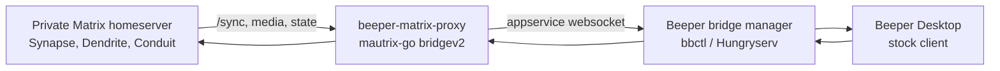

# beeper-matrix-proxy

**Expose rooms from a private Matrix homeserver inside Beeper Desktop, using a
stock Beeper client and a bridgev2 custom bridge.**

[](https://go.dev/)
[](https://matrix.org/)
[](https://developers.beeper.com/bridges/self-hosting)
[](#current-status)

`beeper-matrix-proxy` is an experimental Matrix-to-Beeper proxy built on
[`mautrix-go` bridgev2](https://pkg.go.dev/maunium.net/go/mautrix/bridgev2).
It treats a normal Matrix homeserver as the remote network and exposes joined
rooms inside Beeper through Beeper's self-hosted bridge flow (`bbctl`).

It does **not** patch Beeper Desktop. The bridge tries to speak the data contract
that Beeper already understands: room features, Matrix events, media metadata,
portal rooms, and appservice websocket traffic.

## The Short Version

| Question | Answer |
|---|---|
| Can I sign into an arbitrary Matrix homeserver directly from Beeper Desktop? | Not generally. Beeper Desktop is designed around Beeper accounts and Beeper-managed bridge accounts. |
| Can this project show rooms from my private Matrix server in Beeper? | Yes, that is the goal: private Matrix homeserver -> this bridge -> Beeper. |
| Can this reuse Beeper Cloud's existing WhatsApp/Telegram/Signal bridges on my own Synapse? | Not directly. Those bridges are registered to Beeper's homeserver and account model. |
| Can I run official/community bridges for my own Synapse instead? | Yes. Run the upstream Matrix bridge against your Synapse as its own appservice. |
| Can one bridge feed both Beeper and my Synapse? | Usually not safely from the same database. Run separate bridge instances or build a dedicated fanout layer. |

## Architecture



Beeper's official self-hosting docs describe `bbctl` as a tool for running
self-hosted bridges with a Beeper account. Beeper's bridge metadata also
distinguishes cloud, self-hosted, local, and platform-sdk providers. This matters
because a Beeper Cloud bridge is not a portable appservice registration that can
simply be pointed at your own Synapse.

## Current Status

This is a working research/prototype bridge, not a polished product. It already
contains the core compatibility fixes that made private Matrix rooms usable in
Beeper during testing:

- burst-safe Matrix `/sync`
- room discovery and portal creation
- message, edit, reply, and relation ID rewriting
- Beeper-compatible poll fallback normalization
- media reupload between homeservers
- opt-in bridgev2 direct media support with signed, expiring media IDs
- live typing notifications and read receipts
- Matrix call invites bridged as safe notices
- conservative media size capabilities to avoid proxy-side HTTP 413 failures
- restart-safe remote reaction redactions
- lean Matrix sync filter with lazy-loaded members
- bounded echo-suppression cache for Beeper -> Matrix sent events

The remaining work is mostly around completeness: richer voice/GIF behavior,
two-phase sync checkpointing, full poll lifecycle support, sync-gap backfill,
and safe cleanup tooling for old broken backfill events.

## Feature Matrix

Legend:

- **Supported**: implemented and covered by tests or live smoke testing
- **Partial**: implemented enough to be useful, but still missing edge cases or full E2E coverage
- **Planned**: intentionally not wired yet
- **Not supported**: not safe to expose as a native Beeper feature

| Feature | Status | Direction | Verification | Notes |
|---|---:|---|---|---|
| Text messages | Supported | Matrix -> Beeper, Beeper -> Matrix | Live smoke test | Plain `m.room.message` events round-trip. |
| Burst delivery | Supported | Matrix -> Beeper | Regression test + live 8/8 burst test | Remote sync timeline limit is raised to avoid losing fast messages. |
| Room discovery | Supported | Matrix -> Beeper | Live smoke test | Joined remote Matrix rooms are synced as Beeper portal rooms. |
| Room name/topic | Supported | Matrix -> Beeper | Code path | Uses Matrix room state during chat sync. |
| Replies | Supported | Both | Regression test + live raw-event check | Beeper-local event IDs are rewritten to remote Matrix IDs. |
| Threads | Partial | Both | Regression test | Thread root IDs are rewritten; deeper UI behavior needs more testing. |
| Reactions | Partial | Both | Regression test | Add/remove paths persist remote metadata across restarts; broader Matrix client compatibility still needs live matrix testing. |
| Edits | Supported | Both | Regression test + live smoke test | Legacy Matrix edit fallback prefixes are stripped for Beeper rendering. |
| Redactions / deletes | Partial | Both | Code path | Live delete paths exist; historical cleanup requires explicit redaction tooling. |
| Images | Supported | Both | Regression test | Media is reuploaded by default; direct media is available when bridgev2 direct media is enabled. |
| Files | Supported | Both | Regression test | Same media path as images; upload size and direct download size are capped. |
| Videos | Partial | Both | Code path | Works as media; large files depend on real proxy and homeserver limits. |
| GIFs | Partial | Both | Code path | Metadata handling exists; GIF-to-MP4 transcoding is not implemented yet. |
| Voice messages | Partial | Both | Payload support | Voice metadata is supported; waveform generation needs more work. |
| Polls | Partial | Matrix -> Beeper | Regression test + log-level E2E | Poll starts are normalized with MSC1767 text fallbacks; votes/end need E2E tests. |
| Backfill / history | Partial | Matrix -> Beeper | Code path | Backfill APIs exist; safe placeholder cleanup is intentionally separate. |
| Avatars | Partial | Matrix -> Beeper | Code path | Downloadable avatars work; stale media is improved by authenticated media and signed direct media. Direct origin fallback is disabled unless allowlisted. |
| Typing notifications | Supported | Both | Regression test + code path | Beeper typing is sent to remote Matrix; remote Matrix typing is queued back to Beeper. |
| Read receipts | Supported | Both | Code path | Exact Beeper receipts are sent to remote Matrix; remote Matrix receipts are queued to Beeper. |
| Native audio/video calls | Not supported | Both | Intentionally hidden | Custom bridges should emit call notices/links instead of fake native call UI. |
| End-to-end encryption | Planned | Both | Not implemented as a product feature | Needs a separate device, key, and trust model design. |

## Can This Reuse Existing Beeper Bridges?

Short answer: **not directly**.

Beeper's own bridges are Matrix bridges, but the running bridge account is tied
to where it runs:

| Existing bridge type | Can this proxy reuse it for your own Synapse? | Why |
|---|---:|---|
| Beeper Cloud bridge | No | It is registered to Beeper's infrastructure and Beeper account model, not your Synapse appservice namespace. |
| Beeper self-hosted bridge via `bbctl` | Not directly | `bbctl` generates Beeper-side appservice config. The same process/database should not be blindly attached to another homeserver. |
| Beeper local/on-device bridge | No | It behaves like a local account provider for Beeper, not a generic Matrix appservice for Synapse. |
| Official mautrix bridge run against your Synapse | Yes | Register it as an appservice on your homeserver using the bridge's normal docs. |
| Dedicated fanout bridge | Possible | A custom layer could mirror events into both Beeper and Synapse, but must solve dedupe, edits, redactions, media, and identity mapping. |

The practical patterns are:

1. **Private Matrix in Beeper**: use this project.
2. **WhatsApp/Telegram/Signal in your own Matrix server**: run the relevant
   official/community Matrix bridge against your own homeserver.
3. **Same external account in both Beeper and your Matrix server**: run two
   separate bridge instances if the upstream network allows it, or design a
   dedicated fanout bridge. Sharing one live bridge database between two
   homeservers is a recipe for broken rooms and duplicate state.

## Setup

### Requirements

- Go 1.25+
- `libolm`
- Beeper Bridge Manager (`bbctl`)
- a Beeper account with self-hosted bridge support
- a Matrix account on the remote homeserver you want to expose in Beeper

On macOS:

```bash
brew install libolm
```

### Build

```bash
CGO_CFLAGS="-I/opt/homebrew/opt/libolm/include" \
CGO_LDFLAGS="-L/opt/homebrew/opt/libolm/lib -lolm" \
go build -o beeper-matrix-proxy
```

### Configure the Remote Matrix Homeserver

```bash
export LOCAL_MATRIX_HS="https://matrix.example.com"
```

Optional environment variables:

| Variable | Default | Purpose |
|---|---:|---|
| `LOCAL_MATRIX_HS` | `https://matrix.example.com` | Remote Matrix homeserver used for user login and sync. |
| `LOCAL_MATRIX_INSECURE_TLS` | disabled | Set to `1`, `true`, or `yes` only for self-signed/private TLS during development. |
| `LOCAL_MATRIX_INITIAL_BACKFILL_LIMIT` | `0` | Initial history import limit. |
| `LOCAL_MATRIX_MAX_UPLOAD_SIZE` | remote media config | Caps the size advertised to Beeper when a proxy has a smaller real limit. |
| `LOCAL_MATRIX_DIRECT_MEDIA_MAX_SIZE` | `104857600` | Maximum bytes accepted by the direct Matrix media fallback before aborting the download. |
| `LOCAL_MATRIX_DIRECT_MXC_FALLBACK_ALLOWLIST` | disabled | Comma-separated MXC homeserver allowlist for unauthenticated direct-origin media fallback. Leave empty unless you explicitly trust those media origins. |
| `BEEPER_MATRIX_PROXY_DIRECT_MEDIA_KEY` | required for direct media | Secret HMAC key used to sign generated direct media IDs. Without this, the bridge falls back to normal media reupload. |
| `BEEPER_MATRIX_PROXY_DIRECT_MEDIA_TTL` | `24h` | Lifetime for generated direct media IDs, using Go duration syntax such as `6h` or `30m`. |
| `BEEPER_MATRIX_PROXY_DIR` | current directory | Directory used by `run-bridge.sh`. |
| `BEEPER_MATRIX_PROXY_BINARY` | `./beeper-matrix-proxy` | Binary used by `run-bridge.sh`. |
| `BEEPER_BRIDGE_NAME` | `sh-vcvm-matrix` | Bridge registration name passed to `bbctl run`. The default preserves the existing local test registration; set it to `beeper-matrix-proxy` for a fresh public-name registration. |
| `BEEPER_MATRIX_PROXY_AUTOBUILD` | `1` | Build the binary automatically before `bbctl run` when it is missing. |
| `BEEPER_BBCTL` | `bbctl` | `bbctl` binary path. |

`run-bridge.sh` also loads a local `.env` file from the project directory before
starting `bbctl`. This is the recommended place for deployment-specific values
such as `LOCAL_MATRIX_HS` or `LOCAL_MATRIX_INSECURE_TLS`; `.env` is git-ignored.

Compatibility note: the public repository, binary, and Beeper network identity
are named `beeper-matrix-proxy`, but the internal `mxmain` program name remains
`minibridge` for existing deployments. mautrix uses that internal name as the
database owner key, so changing it would make an existing database refuse to
start until manually migrated.

### Generate Config

```bash
go run . --generate-example-config -c config.yaml
go run . -g -c config.yaml -r registration.yaml
```

Fill the generated config with the appservice values from Beeper Bridge Manager.
Keep these files local:

- `config.yaml`
- `registration.yaml`
- bridge databases
- logs
- built binaries

They are ignored by `.gitignore`.

### Run

```bash
export BEEPER_MATRIX_PROXY_DIR="$PWD"
export BEEPER_MATRIX_PROXY_BINARY="$PWD/beeper-matrix-proxy"
./run-bridge.sh
```

Then start the login flow from Beeper and authenticate with the remote Matrix
homeserver username/password.

## Development

Run tests:

```bash
CGO_CFLAGS="-I/opt/homebrew/opt/libolm/include" \
CGO_LDFLAGS="-L/opt/homebrew/opt/libolm/lib -lolm" \
go test ./...
```

Important test coverage:

| Test area | File |
|---|---|
| Sync burst filter, edits, polls, relation rewriting | `connector/bridge_contract_test.go` |
| Media URLs and upload limits | `connector/media_test.go` |
| Local Synapse burst sync E2E | `connector/synapse_e2e_test.go`, `e2e/synapse/run.sh` |

Run the performance suite:

```bash
./scripts/perf.sh
```

Run the full local Synapse E2E performance suite:

```bash
RUN_SYNAPSE_E2E=1 LOCAL_SYNAPSE_E2E_BURST=40 ./scripts/perf.sh
```

The Synapse suite starts a disposable Docker Synapse using the official
`matrixdotorg/synapse` image, registers a test user, uploads the bridge's sync
filter, sends a burst of messages, and verifies that the next `/sync` response
contains every burst message. It raises Synapse test ratelimits in the temporary
config so the test measures the bridge/filter behavior instead of default
homeserver throttling.

## Design Notes

### Beeper Room Features

Beeper Desktop enables many compose actions from room state, especially
`com.beeper.room_features`. The bridge sets capabilities in code and bumps the
bridge info version when the feature contract changes, so existing rooms can
receive updated state.

### Event ID Mapping

Beeper and the remote Matrix homeserver have different event IDs for the same
logical message. Replies, thread roots, reactions, edits, and deletes must be
rewritten through the bridge database before crossing sides. Otherwise Beeper
IDs such as `$event:beeper.local` leak into the remote homeserver where they
cannot resolve.

### Performance

The bridge sync filter intentionally asks Synapse for only the event classes the
proxy consumes. Room state is restricted to name, avatar, topic, and membership,
with lazy-loaded members enabled to avoid large state payloads in busy rooms.

Message cloning is on the hot path for every bridged event, so it avoids generic
JSON round-tripping and deep-copies only the mutable fields the connector edits.
On an Apple M4 Pro test run, the clone benchmark improved from roughly
`2408 ns/op`, `1425 B/op`, and `20 allocs/op` to roughly `130 ns/op`, `576 B/op`,
and `5 allocs/op`.

The sent-event echo suppression cache is bounded so a long remote outage cannot
turn missed echo events into unbounded memory growth.

### Media

Media is reuploaded by default instead of blindly forwarding `mxc://` URIs.
That keeps Beeper and the remote Matrix server from trying to dereference
unknown media repositories. When bridgev2 direct media is enabled in the
appservice config and `BEEPER_MATRIX_PROXY_DIRECT_MEDIA_KEY` is set, unencrypted
remote Matrix media can also be exposed through the bridge media proxy using
signed, expiring generated MXC URIs.

The direct download path tries Matrix 1.11 authenticated media through the
configured homeserver client first, then legacy media endpoints on that same
client. Direct unauthenticated fetches from arbitrary MXC origins are disabled
by default and require `LOCAL_MATRIX_DIRECT_MXC_FALLBACK_ALLOWLIST`, because
those requests are otherwise too easy to turn into SSRF or token-leak mistakes.
Every direct download enforces `LOCAL_MATRIX_DIRECT_MEDIA_MAX_SIZE`.

### Calls

Native audio/video calls are intentionally not exposed as a supported capability.
The safe custom-bridge behavior is to convert incoming call events into
`m.notice` messages. The bridge already emits a safe notice for Matrix call
invites; richer Element Call links are still planned.

## Roadmap

| Priority | Work item | Why it matters |
|---:|---|---|
| 1 | Safe ghost cleanup tool | Redact old placeholder events without hand-editing databases. |
| 1 | Two-phase remote sync checkpointing | Avoid dropping missed Matrix messages if the process crashes after receiving a `/sync` response but before all events are bridged. |
| 1 | Sync-gap backfill recovery | Detect and repair missed remote Matrix events after transient homeserver outages. |
| 2 | Better call notice links | Preserve call awareness with direct Element Call / Matrix room links. |
| 2 | Voice waveform fallback | Make voice notes render reliably when the source client omits waveform data. |
| 2 | Poll vote/end round-trip | Finish full MSC3381 behavior in both directions. |
| 3 | Optional GIF transcoding | Reduce large GIF upload failures and improve autoplay behavior. |

## Safety

This bridge creates real Matrix events. Test in small rooms first, keep backups
of bridge databases, and use dry-runs for cleanup/redaction tooling.

## References

- [Beeper self-hosted bridges](https://developers.beeper.com/bridges/self-hosting)
- [Beeper bridge metadata providers](https://developers.beeper.com/desktop-api-reference/cli/resources/bridges)
- [Beeper bridge-manager](https://github.com/beeper/bridge-manager)
- [mautrix-go bridgev2](https://pkg.go.dev/maunium.net/go/mautrix/bridgev2)

## License

No license has been selected yet. Until a license is added, treat this repository
as source-available rather than open-source.
